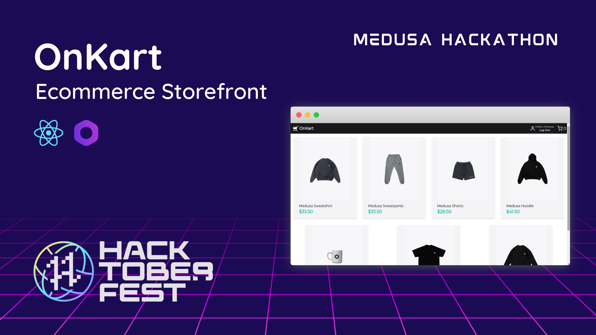

# OnKart - Ecommerce Storefront



## About

### Participants

GitHub: @vishwast03

Twitter: [@vishwast03](https://twitter.com/vishwast03)

Discord: Vishwas Tyagi#2100

### Description

An eCommerce web storefront built using Medusa and ReactJS. It includes a product screen, cart, checkout, and payment.

### Preview


## Set up Project

Here's how to setup and run the project locally :

### Prerequisites

Here are some pre-requisites that you may require to run the project on your system.

Prerequisites:

- [Node.js v16.x](https://nodejs.org/en/)
- Medusa Server (Link to [Quickstart](https://docs.medusajs.com/quickstart/quick-start) here).
- Stripe account ([Stripe](https://stripe.com/en-in))
- [Stripe plugin](https://docs.medusajs.com/add-plugins/stripe/) is required on the Medusa server

### Install Project

Here are the steps to be taken to run the project locally:

1. Clone the repository:

```bash
git clone https://github.com/vishwast03/OnKart.git
```

2. Change directory and install dependencies:

```bash
cd OnKart
medusa new my-medusa-store --seed
cd my-medusa-store
medusa develop
cd ..
npm install
npm run dev
```

## Resources

Here are some resources to refer while working with this project:

- [Medusa’s GitHub repository](https://github.com/medusajs/medusa)
- [Medusa Admin Panel](https://github.com/medusajs/admin)
- [Medusa Documentation](https://docs.medusajs.com/)
- [React Documentation](https://reactjs.org/docs/getting-started.html)
- [Tailwind CSS](https://tailwindcss.com/docs/)
